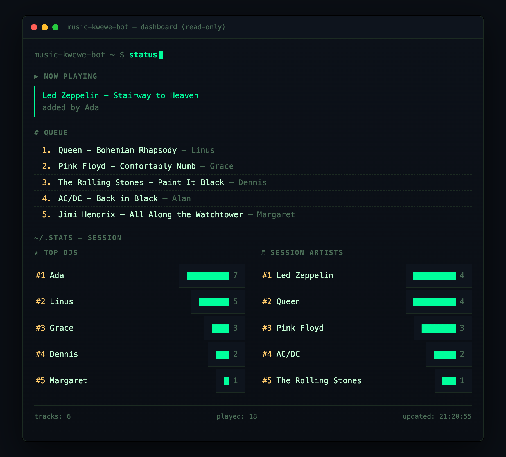

# 🎸 music-kwewe-bot

> One Telegram chat. One speaker. Everybody's a DJ.

You know the scene: a few friends, a room, and one set of speakers. Someone
hooks their laptop up, and for the rest of the night it's a fight over the aux
cable. **music-kwewe-bot** is the fix. Drop a YouTube link in the group chat and
it lands in a shared queue — first come, first played, no aux wars. Everyone
adds, the bot plays them back-to-back, and the running order is fair game for
the whole crew.

It's a tiny Go service: a Telegram bot up front, a queue in the middle, and
`mpv` doing the actual playing out the back.



*(the read-only dashboard — what's spinning now, who queued what, plus the
session's top DJs and most-played artists)*

## The vibe

- 🎶 **Everyone's the DJ.** Paste a link, it's in the queue. The bot tells the
  chat what just got added and what's playing now.
- 🤝 **No aux wars.** It's a fair FIFO line. Your banger plays after the bangers
  ahead of it — not whenever someone yanks the cable.
- 🙋 **Credit where it's due.** Every track remembers who queued it, so the
  group knows exactly who's responsible for that third Nickelback song.
- 🖥️ **A little terminal dashboard.** Open it in a browser to see the now-playing
  track and the full lineup, live.

## How it actually works

```
Telegram chat  →  bot (links + commands)  →  shared FIFO queue  →  player  →  mpv 🔊
                                                     ↑
                                          read-only web dashboard
```

- **bot** — reads the group chat. Any YouTube / `youtu.be` / `music.youtube.com`
  link gets queued; slash commands run the show.
- **queue** — an in-memory, thread-safe line. First in, first played.
- **player** — pulls one track at a time and plays it with `mpv --no-video`.
  mpv leans on `yt-dlp` to resolve the stream, so it **streams** the audio —
  nothing is downloaded to disk. When a song starts/ends, the chat hears about it.
- **dashboard** — a read-only web page on `:7070` showing now-playing + queue.

> Heads up: the queue lives in memory, so a restart wipes the lineup. And the
> music comes out of **the machine running the bot** — so run it on the laptop
> that's plugged into the speakers.

## Getting the party started

You'll need **Go 1.26+**, plus [`mpv`](https://mpv.io/) and
[`yt-dlp`](https://github.com/yt-dlp/yt-dlp) (mpv uses yt-dlp to fetch the
audio, and the bot uses it for track titles).

**1. Install the deps and make your `.env`:**

```sh
make setup
```

This runs `scripts/install.sh` (`brew install mpv yt-dlp`) and copies
`.env.example` → `.env`.

**2. Grab a bot token from [@BotFather](https://t.me/BotFather)** and drop it in
`.env`:

```
TELEGRAM_BOT_TOKEN=123456:abc...
```

**3. Crank it up:**

```sh
make run
```

The dashboard pops open at <http://localhost:7070>. Add the bot to your group
chat, start pasting links, and you're off.

> `.env` is loaded automatically and is gitignored. A real environment variable
> wins over the `.env` value if both are set. Change the dashboard port with
> `DASHBOARD_ADDR` (e.g. `DASHBOARD_ADDR=:9000`).

### Make targets

| Command | Does |
|---|---|
| `make setup` | Install Homebrew deps + create `.env` from template |
| `make run`   | Run the service (`go run .`) |
| `make build` | Build the `music-queue` binary |
| `make test`  | Run tests |
| `make clean` | Remove the built binary |

## Commands (talk to the bot)

Just paste a link to queue a song. For everything else:

| Command | What it does |
|---|---|
| `/now_playing` | What's spinning right now |
| `/kwewe` | Show the whole lineup |
| `/next` | Jump to the next track |
| `/skip` | Skip what's playing |
| `/clear` | Wipe the queue (use responsibly) |
| `/help` | The cheat sheet |

*(Old habits welcome: `/queue`, `/now`, and `/list` work too.)*

## For the tinkerers

Run the tests:

```sh
go test ./...
```

Want to mess with the dashboard's look without spinning up a real bot? There's
a seeded preview with sample data:

```sh
go run ./cmd/dashpreview   # serves the dashboard on :7171 with fake tracks
```

Now go forth and settle the aux war for good. 🤘
